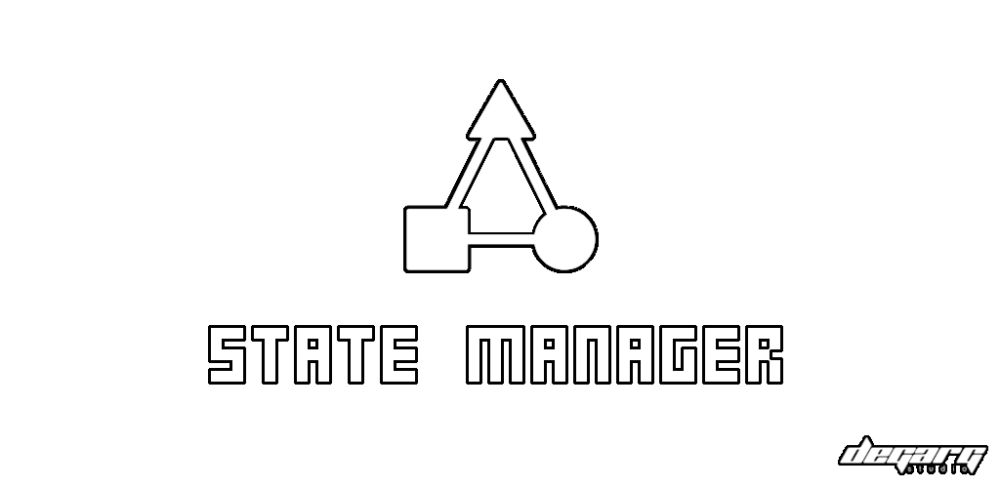

# StateManager

  

A [Godot](https://godotengine.org/) plugin that adds different states for nodes.

# Installation

1. Download the `addons` folder from this repository.
2. Place it into your project's root folder.
3. Go to `Project > Project Settings > Plugins` and enable StateManager plugin

# Usage

## StateManager
It is the node that will manage the states that have been assigned to it. Add a `StateManager` on any node where you want to have states.

### Properties
- **autostart**: If `true` then the state loop begins automatically at the start.
- **one_loop**: If `true` then the state loop stops indefinitely when it ends.

### Methods
- **start()**:  Starts the state loop.
- **stop()**: Pauses the state loop.
- **get_current_state_tag()**: Returns the current state tag.

## State
Is the base class of all the states. To use a state simply add it as a child of a `StateManager` and configure it (Depending on the type of state). This class is not intended to be added directly to the scene tree.

### Properties
- **tag**: The tag with which the state will be identified.

### Signals
- **started_state**: Is emitted every time the state starts.
- **processing_state**: Is emitted on each frame in which the state is active.
- **finished_state**: Is emitted every time the state ends.

## StateCondition
This state will be active until the return value of condition_callable becomes `false` (`true` if **negative_condition** is activated).

### Properties
- **condition_callable**: It is a callable where the result of the condition will be returned. Should always return boolean values.

## StateTimer
This state will be active until the specified seconds have passed.

### Properties
- **wait_time**: The seconds in which the state will be active.

## StateRandTimer
Similar to StateTimer only the timeout will be a random value from a range specified in **from** and **to**.

## StateGroup
It is a state where other states are grouped. It will be active as long as its state loop is active. To add a state to it just add it as a child.

# Assets
The sprites of the example project were made by [ZeggyGames](https://zegley.itch.io/).
