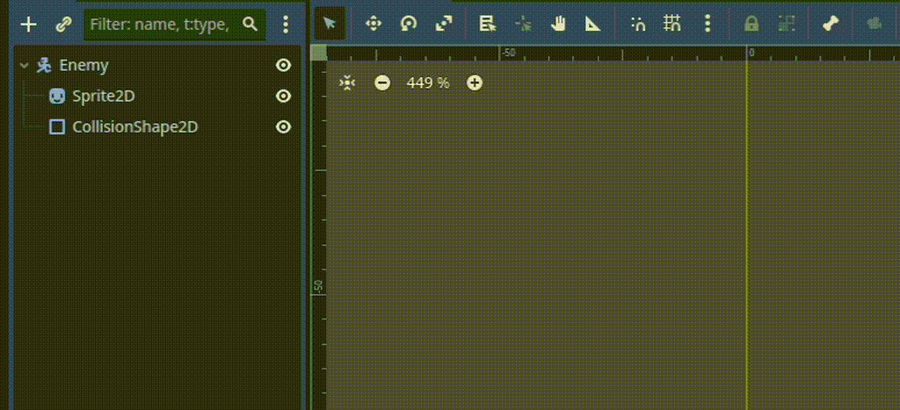
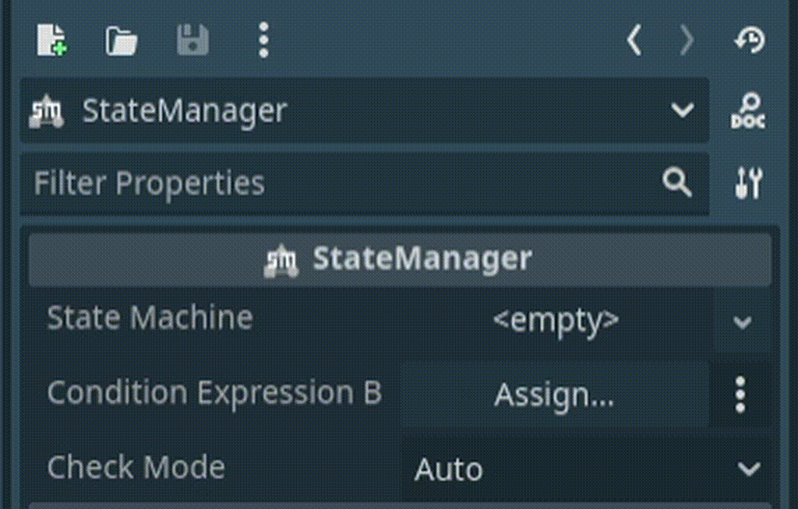
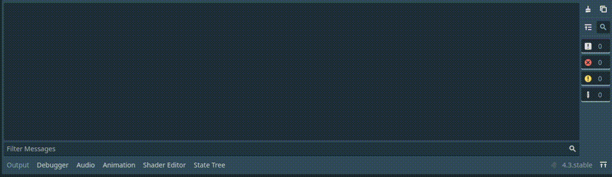
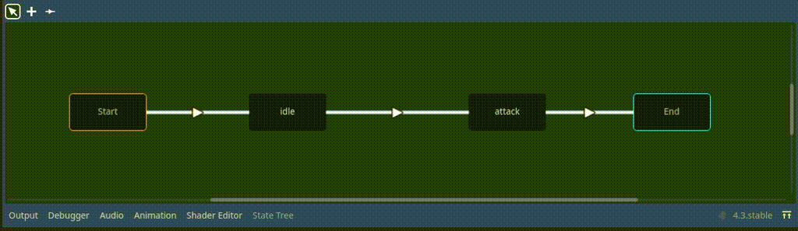
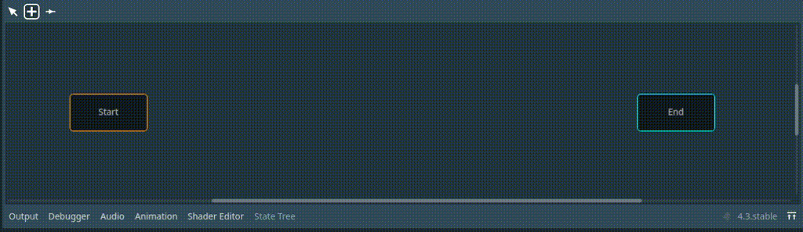
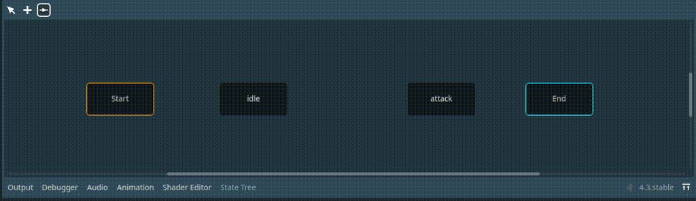

# StateManager

  

A [Godot](https://godotengine.org/) plugin that adds different states for nodes.

# Installation

1. Download the `addons` folder from this repository.
2. Place it into your project's root folder.
3. Go to `Project > Project Settings > Plugins` and enable StateManager plugin

# Usage

### 1. Add a `StateManager` on any node where you want to have states.

### 2. Set `State Machine` and `Condition Expression Base` for the expressions.

### 3. To edit `StateMachine` select the `StateManager` and go to `State Tree` in the bottom panel.

# Editing StateMachine
## Edit Mode
 In `Edit` mode you can **move** (Click), **change the name** (Double Click) and **delete** (Del) an element.

## Add Mode
 In `Add` mode you can **add a state** (Click).

## Connection Mode
 In `Connection` mode you can **connect** one state to another (Keeping click and dragging to another state).

# Classes

## StateManager
The node that will manage the states that have been assigned to it.

### Properties
- **state_machine**: The `StateMachine` resource.
- **condition_expression_base**: The node where the condition expression will be evaluated.
- **check_mode**: Determine whether the conditions will be evaluated manually or automatically.

### Methods
- **check_condition()**: Evaluates the condition and advance to the next state in case it is fulfilled.
- **get_current_state()**: Returns the current state name.

## StateMachine
The resource containing the states and is managed by `StateManager`. Can be edited from the Editor.

## State
The resource of the `State`.

### Properties
- **custom_condition_expression_base**: An override for the default `condition_expression_base`.
- **condition_signal**: The signal to await to evaluate the condition. (First wait for the signal and then evaluate the condition)
- **condition_expression**: The condition to advance to the next state.

## StateConnection
Connect one `State` with another. A `State` can have multiple connections.

### Properties
- **priority**: The priority of the connection over another. Useful for multiple connections.
- **condition_expression**: A condition to evaluate if can advance to the next state. If empty then advance automatically. Useful for multiple connections.

# Assets
The sprites of the example project were made by [ZeggyGames](https://zegley.itch.io/).
